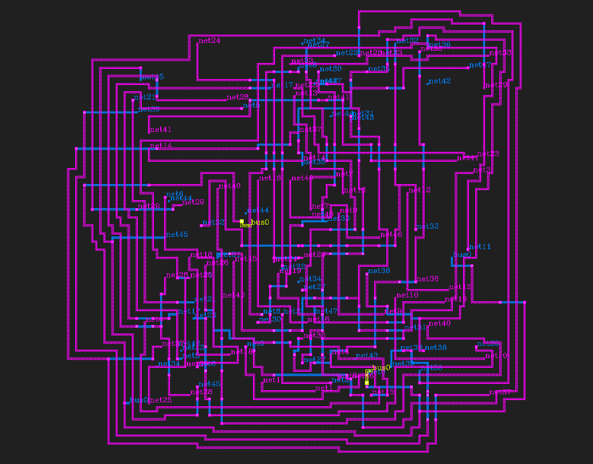
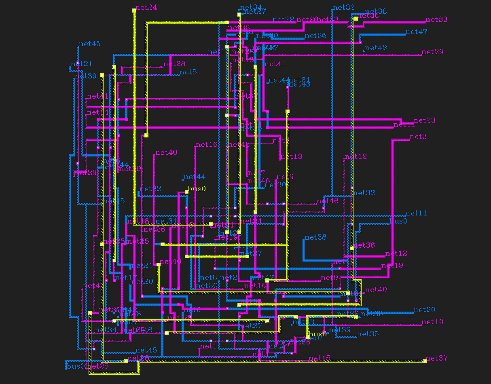

# g_route

Grid-based Manhattan/via-aware autorouter for IC/photonic-style layouts.
Reads a JSON layer-stack config, routes nets with A\* over a Manhattan grid,
and writes output to [KLayout](https://www.klayout.de/) Layout objects.

This is an LLM written python port of a basic C++ router I wrote for another project. The results are quite good (at least in terms of performance as compared to my C++ version), so I will likely continue development here.

See `g_route/SKILL.md` for full usage documentation, API reference, and
worked examples. I was able to get Claude to generate fully routed GDS files with this skill, I'd imagine there's quite a bit of potential here when combined with a cell library and some PCELLs.

## Install

```bash
pip install .
# or, editable for development:
pip install -e .
```

## Quick start

```python
import klayout.db as db
from g_route import RoutingConfig, GDSRouter, Net, Port, RouteStrat

rcfg = RoutingConfig.from_file("layers.json")

layout = db.Layout()
layout.dbu = 0.001
top = layout.create_cell("TOP")

net = Net("netA", [
    Port.point("p1", 0.0, 0.0, "m1"),
    Port.point("p2", 10.0, 6.0, "m1"),
])

router = GDSRouter.from_nets(layout, top, [net], rcfg, pitch_um=0.5, padding_um=5.0)
router.route(RouteStrat.MultiStart)
layout.write("out.gds")
```

## Images

### Example 1:

24 2-port nets, 24 3-port nets, and 1 4-port net  
M2 routing preferred through aggressive weighting  
4 nets failed due to randomized port placements producing DRC violations  
Finished in 12.56 seconds  

### Example 2:

Same ports as Example 1  
Uniform route weighting  
4 nets failed due to randomized port placements producing DRC violations  
Finished in 1.93 seconds  